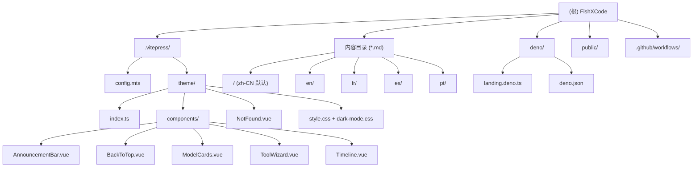

# FishXCode - 项目文档 (CLAUDE.md)

## 项目愿景

FishXCode 是一个 **AI Coding 中转站**，支持 Claude、Codex、Gemini 等主流 AI 模型在多种平台使用。本仓库包含两个核心部分：

1. **文档站** (VitePress) -- 面向用户的多语言文档门户，部署于 `doc.fishxcode.com`
2. **Landing Page** (Deno) -- 独立的单文件 Deno 服务器，服务于 `fishxcode.com` 主站着陆页

## 架构总览

- **技术栈**: VitePress 1.x + Vue 3 + TypeScript + Deno
- **构建工具**: pnpm + Vite (VitePress 内置)
- **部署**: GitHub Pages (文档站，通过 GitHub Actions) + Vercel (额外部署配置) + Deno Deploy (Landing Page)
- **国际化**: 5 种语言 -- 简体中文 (默认)、English、Francais、Espanol、Portugues
- **功能增强**: PWA (workbox)、RSS/Atom Feed 生成、Sitemap、图片缩放 (medium-zoom)、代码块分组图标

## 模块结构图



## 模块索引

| 模块 | 路径 | 语言/框架 | 职责 |
|------|------|-----------|------|
| VitePress 文档站 | `/` (根) | TypeScript + Vue 3 + VitePress | 多语言文档门户，包含工具指南、模型列表、FAQ 等 |
| Deno Landing Page | `deno/` | TypeScript + Deno | FishXCode 主站着陆页单文件服务器，含 i18n、SEO、KV 访问计数 |
| 自定义主题 | `.vitepress/theme/` | Vue 3 + CSS | 自定义 404 页面、公告栏、回到顶部、模型卡片、工具向导、时间线组件 |
| CI/CD | `.github/workflows/` | YAML | GitHub Actions 自动构建部署到 GitHub Pages |

## 运行与开发

### 文档站 (VitePress)

```bash
# 安装依赖
pnpm install

# 开发模式
pnpm dev

# 构建
pnpm build

# 预览构建结果
pnpm preview
```

### Deno Landing Page

```bash
cd deno/
deno run --allow-net --allow-env --unstable-kv landing.deno.ts
```

### 部署

- **文档站**: 手动触发 `.github/workflows/deploy.yml` (workflow_dispatch) 部署到 GitHub Pages
- **Vercel**: 根目录 `vercel.json` 配置 SPA 重写规则与安全头
- **Deno Landing**: 部署到 Deno Deploy

## 目录结构详解

```
fishxcode/
├── .github/workflows/deploy.yml  # GitHub Actions: 构建 + 部署 GitHub Pages
├── .vitepress/
│   ├── config.mts                # VitePress 主配置 (i18n, SEO, Feed, PWA, 导航/侧边栏)
│   └── theme/
│       ├── index.ts              # 主题入口 (注册组件, medium-zoom)
│       ├── NotFound.vue          # 自定义多语言 404 页面
│       ├── style.css             # 品牌色、按钮、Hero 区域样式变量
│       ├── dark-mode.css         # 深色模式增强 (代码块、导航毛玻璃、滚动条)
│       └── components/
│           ├── AnnouncementBar.vue  # 顶部公告栏 (可关闭, localStorage 记忆)
│           ├── BackToTop.vue        # 回到顶部按钮
│           ├── ModelCards.vue       # 模型展示卡片网格
│           ├── ToolWizard.vue       # 交互式工具推荐向导 (3 步骤)
│           └── Timeline.vue         # 时间线组件 (IntersectionObserver 动画)
├── deno/
│   ├── deno.json                 # Deno 配置 (启用 unstable kv)
│   └── landing.deno.ts           # 单文件 Landing Page 服务器 (~88KB)
├── public/
│   ├── img/logo.svg              # 网站 Logo
│   ├── robots.txt                # 爬虫规则
│   └── _headers                  # Cloudflare/Vercel 安全响应头 + 缓存策略
├── en/ fr/ es/ pt/               # 各语言翻译目录 (镜像根目录 md 结构)
├── *.md                          # 中文 (默认语言) 内容页面
│   ├── index.md                  # 首页 (VitePress Home Layout)
│   ├── start.md                  # Claude Code 使用指南
│   ├── account.md                # 账户注册
│   ├── codex.md                  # OpenAI Codex 指南
│   ├── gemini.md                 # Gemini CLI 指南
│   ├── roocode.md                # RooCode 指南
│   ├── qwencode.md               # Qwen Code 指南
│   ├── droid.md                  # Droid CLI 指南
│   ├── opencode.md               # OpenCode 指南
│   ├── openclaw.md               # OpenClaw 指南
│   ├── zcf.md                    # ZCF 快速接入教程
│   ├── models.md                 # 支持的模型列表
│   ├── compare.md                # 工具对比
│   ├── faq.md                    # 常见问题
│   ├── changelog.md              # 更新日志
│   ├── terms.md                  # 用户协议
│   └── privacy.md                # 隐私政策
├── package.json                  # Node 依赖 (vitepress, @vite-pwa, feed 等)
├── vercel.json                   # Vercel 部署配置 (SPA rewrite, 安全头)
├── bun.lock                      # Bun 锁文件
├── pnpm-lock.yaml                # pnpm 锁文件
└── README.md                     # 项目说明
```

## 内容页面清单

共 **15** 个内容页面 x **5** 种语言 = **75** 个 Markdown 文件：

| 页面 | 中文 (根) | en/ | fr/ | es/ | pt/ |
|------|-----------|-----|-----|-----|-----|
| 首页 | index.md | Y | Y | Y | Y |
| Claude Code | start.md | Y | Y | Y | Y |
| 账户注册 | account.md | Y | Y | Y | Y |
| ZCF 接入 | zcf.md | Y | Y | Y | Y |
| OpenAI Codex | codex.md | Y | Y | Y | Y |
| Gemini CLI | gemini.md | Y | Y | Y | Y |
| RooCode | roocode.md | Y | Y | Y | Y |
| Qwen Code | qwencode.md | Y | Y | Y | Y |
| Droid CLI | droid.md | Y | Y | Y | Y |
| OpenCode | opencode.md | Y | Y | Y | Y |
| OpenClaw | openclaw.md | Y | Y | Y | Y |
| 模型列表 | models.md | Y | Y | Y | Y |
| 工具对比 | compare.md | Y | Y | Y | Y |
| FAQ | faq.md | Y | Y | Y | Y |
| 更新日志 | changelog.md | Y | Y | Y | Y |
| 用户协议 | terms.md | Y | Y | Y | Y |
| 隐私政策 | privacy.md | Y | Y | Y | Y |

## 测试策略

- **当前状态**: 项目未配置自动化测试框架
- **构建验证**: `pnpm build` 可作为隐式验证 (VitePress 编译 Markdown + Vue 组件)
- **CI**: GitHub Actions 在 `workflow_dispatch` 触发时执行 `pnpm install && pnpm build`

## 编码规范

- **语言**: TypeScript (ESM, `"type": "module"`)
- **组件**: Vue 3 `<script setup lang="ts">` + Scoped CSS
- **样式**: CSS Variables 体系，遵循 VitePress 默认主题变量命名
- **i18n 模式**: 每个组件内置 `I18N` 常量对象，按 locale key 索引
- **内容 i18n**: 目录分离 (`/` = zh-CN, `/en/`, `/fr/`, `/es/`, `/pt/`)
- **包管理器**: pnpm 优先 (CI 中使用 pnpm@9)
- **Node 版本**: 22.x

## AI 使用指引

- 本项目是纯文档站，修改内容时注意同步 5 种语言版本
- `.vitepress/config.mts` 是核心配置文件，包含所有语言的导航和侧边栏定义
- 新增页面时需要：(1) 创建中文 md (2) 创建 4 种翻译 (3) 在 config.mts 的所有 locale 中添加导航/侧边栏条目
- Vue 组件中的 i18n 文本需覆盖全部 5 种语言
- `deno/landing.deno.ts` 是独立的单文件服务器，约 88KB，包含完整的 HTML/CSS/JS 内联

## 变更记录 (Changelog)

| 日期 | 操作 | 说明 |
|------|------|------|
| 2026-03-05 | 创建 | 首次由 init-architect 自动生成 |
